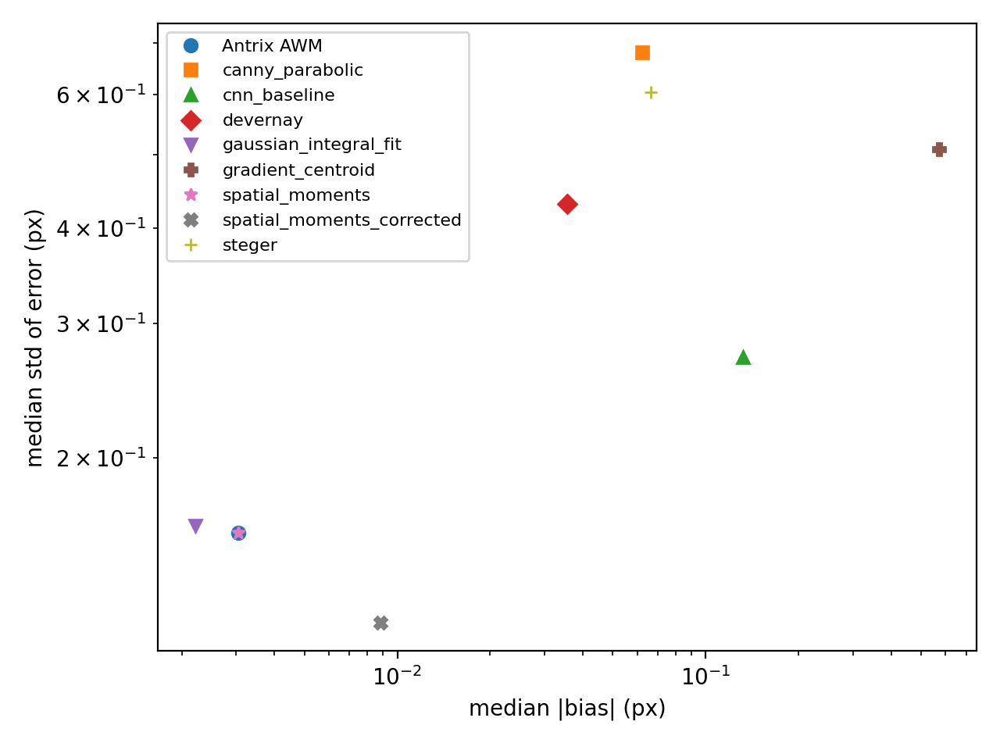
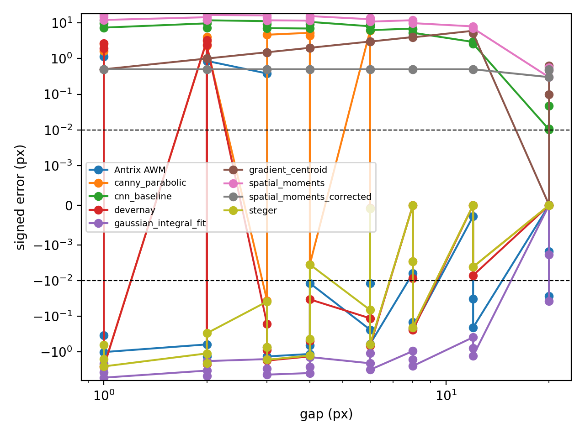
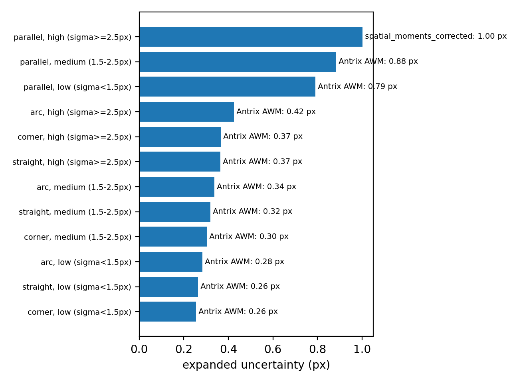

# Antrix AWM

**Sub-pixel edge measurement, engineered for the real world.**

Antrix AWM (Adaptive Window Moments) is our proprietary sub-pixel edge
localization engine — the measurement core behind Antrix's vision-based
dimensional inspection. It finds edge, hole, and gap boundaries in an image
to a small fraction of a pixel, and it keeps that accuracy in conditions
where most edge detectors quietly fail: noisy images and closely-spaced
edges.

## Why it matters

Every optical measurement system lives or dies on one number: how precisely
it can locate an edge. Antrix AWM was benchmarked head-to-head against eight
established sub-pixel detection methods across thousands of simulated
measurement trials, covering straight edges, curved edges, corners, and
narrow gaps, under both clean and noisy imaging conditions.

## Measured accuracy

- **Best overall accuracy when no calibration is available** — lowest
  combined bias + noise error of any tested method, on straight edges,
  curved edges, and corners alike (expanded uncertainty as low as **0.26 px**
  in low-blur conditions).
- **Best-in-class on closely-spaced edges** — where two boundaries sit near
  each other (bore holes, slots, thin features), Antrix AWM stays accurate
  down to gaps where every classical moment-based method breaks down
  completely.
- **Real improvement where it counts most** — on two-edge and
  narrow-feature geometries, Antrix AWM measurably outperforms the previous
  best-in-class method, with up to **~20% lower measurement uncertainty**.
- **Sub-micron-class repeatability** — pixel-locking (the bias that
  repeats at the same sub-pixel phase) is at the noise floor of what is
  measurable, meaning no detectable systematic error tied to where an edge
  falls within a pixel.

## Validated the right way

These numbers are not marketing estimates. They come from a controlled
benchmark with analytically known ground truth (not rendered approximations),
deterministic and independently reproducible results, and a full
nine-detector comparison against established methods from the published
literature. Antrix AWM was evaluated on equal footing with every other
method, not tuned to win.

## Where it fits

- Caliper-jaw and gauge-style dimensional measurement
- Bore and hole diameter inspection
- PCB trace width and spacing verification
- Any machine-vision application where sub-pixel precision on a live camera
  feed — not a lab microscope — needs to be trustworthy

## Figures

*Antrix AWM's position on the accuracy/stability frontier against eight
established detectors.*

*Measurement safety as edges move closer together — Antrix AWM stays
reliable at gaps where classical methods fail.*

*Where Antrix AWM is the top pick across real-world measurement scenarios.*
